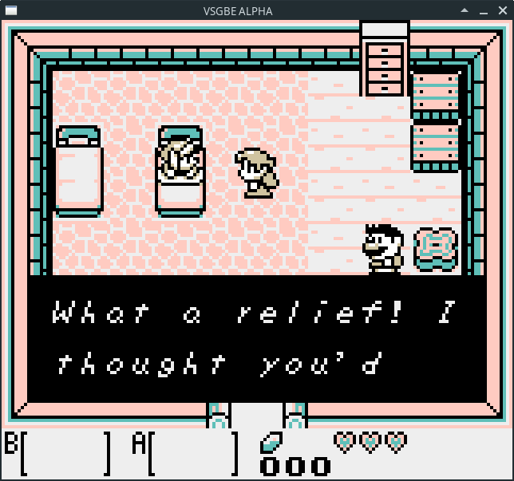
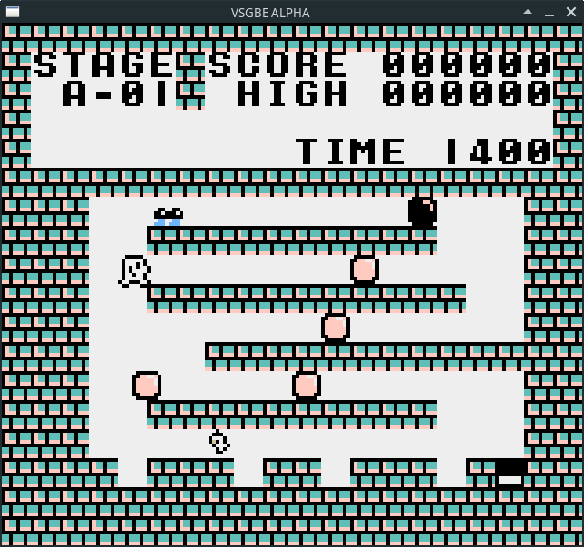
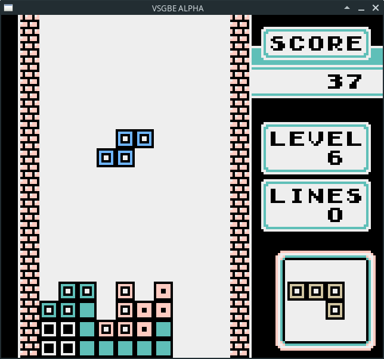

          _____                    _____                    _____                    _____                    _____          
         /\    \                  /\    \                  /\    \                  /\    \                  /\    \         
        /::\____\                /::\    \                /::\    \                /::\    \                /::\    \        
       /:::/    /               /::::\    \              /::::\    \              /::::\    \              /::::\    \       
      /:::/    /               /::::::\    \            /::::::\    \            /::::::\    \            /::::::\    \      
     /:::/    /               /:::/\:::\    \          /:::/\:::\    \          /:::/\:::\    \          /:::/\:::\    \     
    /:::/____/               /:::/__\:::\    \        /:::/  \:::\    \        /:::/__\:::\    \        /:::/__\:::\    \    
    |::|    |                \:::\   \:::\    \      /:::/    \:::\    \      /::::\   \:::\    \      /::::\   \:::\    \   
    |::|    |     _____    ___\:::\   \:::\    \    /:::/    / \:::\    \    /::::::\   \:::\    \    /::::::\   \:::\    \  
    |::|    |    /\    \  /\   \:::\   \:::\    \  /:::/    /   \:::\ ___\  /:::/\:::\   \:::\ ___\  /:::/\:::\   \:::\    \ 
    |::|    |   /::\____\/::\   \:::\   \:::\____\/:::/____/  ___\:::|    |/:::/__\:::\   \:::|    |/:::/__\:::\   \:::\____\
    |::|    |  /:::/    /\:::\   \:::\   \::/    /\:::\    \ /\  /:::|____|\:::\   \:::\  /:::|____|\:::\   \:::\   \::/    /
    |::|    | /:::/    /  \:::\   \:::\   \/____/  \:::\    /::\ \::/    /  \:::\   \:::\/:::/    /  \:::\   \:::\   \/____/ 
    |::|____|/:::/    /    \:::\   \:::\    \       \:::\   \:::\ \/____/    \:::\   \::::::/    /    \:::\   \:::\    \     
    |:::::::::::/    /      \:::\   \:::\____\       \:::\   \:::\____\       \:::\   \::::/    /      \:::\   \:::\____\    
    \::::::::::/____/        \:::\  /:::/    /        \:::\  /:::/    /        \:::\  /:::/    /        \:::\   \::/    /    
     ~~~~~~~~~~               \:::\/:::/    /          \:::\/:::/    /          \:::\/:::/    /          \:::\   \/____/     
                               \::::::/    /            \::::::/    /            \::::::/    /            \:::\    \         
                                \::::/    /              \::::/    /              \::::/    /              \:::\____\        
                                 \::/    /                \::/____/                \::/____/                \::/    /        
                                  \/____/                                           ~~                       \/____/         
                                                                                                       

Um emulador ruim de GameBoy

Introdução

Este é um pequeno projeto que eu comecei por hobby. Tudo começou com uma pequeno videogame caseiro baseado em CPLD e Microntrolador ARM Cortex-M4F que eu realizei a alguns anos atrás, apesar de não ser poderoso, percebi que que talvez seria possível a emulação de algum videogame de 8 bits. Escolhi o game boy justamente pela relativa simplicidade do hardware e por ser um videogame que acesso tenho acesso ao hardware verdadeiro, sem contar a quantidade de informações disponíveis na internet. A primeira versão deste emulador foi escrita em Python, mas por uma questão de performance, eu decidi utilizar a linguagem C++.

Sobre o emulador

Antes de mais nada, esse emulador é ruim, ou melhor dizendo, péssimo. Simples assim, o código é mal documentado, cheio de bugs e da forma que está, pouquíssimos jogos são compatíveis. Esta versão suporta apenas Linux, mas espero fazer um MakeFile decente que suporte o sistema operacional Windows em breve.

Público Alvo

Qualquer um que intenda de C++ e queria mexer em um código de emulação para isso, o código está em licença z-lib, ou seja,
pode ser utilizado para quais quer propósito. Da forma que está, este sofware não é um produto de produção, desta forma, se deseja apenas jogar um jogo sem se importar com detalhes técnicos, este emulador não é para você. Como já foi dito, este código é ruim e possuí todos os tipos de coisas erradas que um programa de computador pode ter entre eles, mas não limitado há: Estouro de pilha, exceções não tratadas, ponteiros selvagens e etc. Este programa não deve ser utilizado de maneira alguma em modo de super usuário (root), e o autor não se responsabiliza por quais quer dano ou perda de dado ou qualquer coisa de ruim que possa acontecer devido a utilização deste programa.

Compilação

Para a compilação é necessário o compilador g++ e a biblioteca SDL na sua versão 2, dentro da pasta principal apenas digite make e arquivo de saída ser vsgbe.out . O caminho para rom a ser executada deve ser dado na linha de comando para chamar o arquivo. Ex: ./vsgbe.out minha_rom.gb

Controles

Direcional : Teclas direcionais Botão A: Tecla A Botão B: Tecla S Start: Tecla X Mode: Tecla Z

Capturas de Tela:

